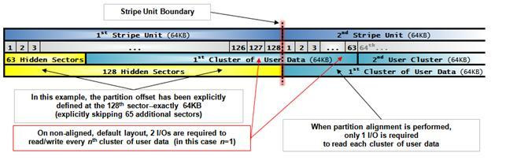
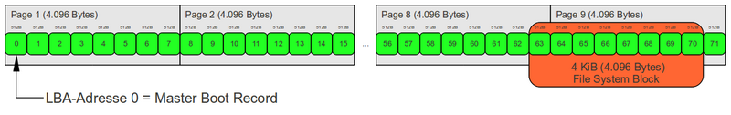
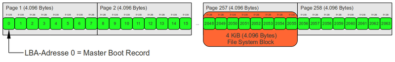

# Disk Partition Aligment

## 1. 파티션 정렬의 이해

기본적으로 Disk partitioning 시에 첫번째 파티션은 항상 64번째 섹터에 해당하는 LBA 주소 63에서 시작하여, 이 섹터는 기본적으로 512 Byte의 크기를 가지고 있습니다.

이 이유는 _**CHS\(Cylinder, Head, Sector\)**_ 가 63 섹터 구조를 가지기 때문입니다. 디스크의 숨겨진 트랙\(Logical Sector 0~62, Total 63 cector, 31.5KB\) 영역이 끝나는 지점\(보통 _**MBR**_ 이라고 하는 영역 입니다.\)이 62 sector 이기 때문입니다.

이런 구조에서, 1 sector가 512 Byte일 경우에는 크게 문제가 없던 것이, disk가 고용량이 되면서, _**Advanced Format**_ 형식\(1sector 당 4K 할당\)의 Disk가 나오면서 또는 RAID 구성시에 _**strip size**_ 를 크게 잡을 경우에 문제가 발생하기 시작 합니다.

 출처:[https://blogs.msdn.microsoft.com/jimmymay/2009/05/08/disk-partition-alignment-sector-alignment-make-the-case-save-hundreds-of-thousands-of-dollars/](https://blogs.msdn.microsoft.com/jimmymay/2009/05/08/disk-partition-alignment-sector-alignment-make-the-case-save-hundreds-of-thousands-of-dollars/)

위의 그림은 RAID 구성시에 strip size을 64K 로 설정하고, cluster size를 64K 로 설정한 경우를 보여 줍니다.

첫번째 줄이 Strip size, 두번째 줄이 sector, 세번째 줄이 정렬이 안된 파티션, 네번째 줄이 정렬이 된 파티션을 의미 합니다.

위의 그림에서 정렬이 되지 않은 3번째 파티션을 보면, sector size가 4K가 되면서 파티션이 63 sector에서 시작을 할 경우, RAID의 strip size 경계를 살짝 넘어서는 문제가 발생을 합니다. 이 의미는, 1번째 cluster를 처리를 하기 위하여 2개의 strip unit을 호출을 해야 한다는 의미가 됩니다. 즉 이 경계를 잘 맞추고 있다면 1번의 호출로 끝나는 것이 경계가 맞지 않아 2번 호출을 해야 한다는 것이 되고, 이 문제는 Disk 의 read/write 성능에 큰 손해를 끼치게 됩니다.

그래서 4번째 줄과 같이, 첫번째 파티션의 시작을 128 sector \(64K\)에서 시작을 하도록 권장을 하고 있습니다.

하지만, 대용량 파일의 read/write 성능을 위하여 format 시에 block size나 RIAD의 strip size를 1M로 설정하는 경우도 있기 때문에 요즘에는 128 sector 보다는 아래와 같이 2048 sector\(1M\)를 권장하고 있습니다.

  출처: [https://www.thomas-krenn.com/en/wiki/Partition\_Alignment](https://www.thomas-krenn.com/en/wiki/Partition_Alignment)

## 2. fdisk 를 이용한 파티셔닝

_**fdisk**_ 의 경우에는 _**util-linux-ng**_ 2.17.1 부터 제대로 된 정렬을 지원 합니다. 그러므로 오래된 OS를 사용하고 있다면 _**fdisk**_ 보다는 _**parted**_ 를 이용할 것을 권고 합니다.

fdisk를 이용하여 파티션 정렬을 할 경우, 2.17.1 이후 버전을 사용하는 것을 권고하며, DOS 호환 모드를 비활성화 시키면, fdisk는 1MB 경계에서 정렬이 됩니다.

_**fdisk**_ 를 이용할 경우, 다음의 사항을 권고 합니다.

1. util-linux-ng 2.17.1 이후 버전을 사용
2. fdisk 의 경고를 잘 보십시오.
3. _**DOS 호환 모드**_를 비활성화 \(-c 옵션\)
4. 표시 단위는 _**sector**_ 를 이용 \(-u 옵션\)
5. 파티션의 끝을 지정할 경우에는, + 사이즈\(M,G\) 옵션 사

### 2.1 잘못된 정렬 예제

아래의 예제는 잘못된 정렬의 예를 보여 주며, 원인은 DOS 호환 모드 때문 입니다.

```text
[root@host ~]$ fdisk /dev/sdb
Device contains neither a valid DOS partition table, nor Sun, SGI or OSF disklabel
Building a new DOS disklabel with disk identifier 0xe4909079.
Changes will remain in memory only, until you decide to write them.
After that, of course, the previous content won't be recoverable.

Warning: invalid flag 0x0000 of partition table 4 will be corrected by w(rite)

WARNING: DOS-compatible mode is deprecated. It's strongly recommended to
         switch off the mode (command 'c') and change display units to
         sectors (command 'u').

Command (m for help): p

Disk /dev/sdb: 160.0 GB, 160041885696 bytes
255 heads, 63 sectors/track, 19457 cylinders
Units = cylinders of 16065 * 512 = 8225280 bytes
Sector size (logical/physical): 512 bytes / 512 bytes
I/O size (minimum/optimal): 512 bytes / 512 bytes
Disk identifier: 0xe4909079

   Device Boot      Start         End      Blocks   Id  System

Command (m for help): n
Command action
   e   extended
   p   primary partition (1-4)
p
Partition number (1-4): 1
First cylinder (1-19457, default 1): 
Using default value 1
Last cylinder, +cylinders or +size{K,M,G} (1-19457, default 19457): +10G

Command (m for help): u
Changing display/entry units to sectors

Command (m for help): p

Disk /dev/sdb: 160.0 GB, 160041885696 bytes
255 heads, 63 sectors/track, 19457 cylinders, total 312581808 sectors
Units = sectors of 1 * 512 = 512 bytes
Sector size (logical/physical): 512 bytes / 512 bytes
I/O size (minimum/optimal): 512 bytes / 512 bytes
Disk identifier: 0xe4909079

   Device Boot      Start         End      Blocks   Id  System
/dev/sdb1              63    20980889    10490413+  83  Linux

Command (m for help): q
[root@host ~]$
```

### 2.2 2.17.1 이전의 fdisk를 이용한 파티션 정렬

_**-S 32 -H 64**_ 옵션을 사용하여, 두번째 synlinder를 정렬에 사용할 수 있습니다.

```text
[root@host ~]$ fdisk -S 32 -H 64 /dev/sdc

The number of cylinders for this disk is set to 65536.
There is nothing wrong with that, but this is larger than 1024,
and could in certain setups cause problems with:
1) software that runs at boot time (e.g., old versions of LILO)
2) booting and partitioning software from other OSs
   (e.g., DOS FDISK, OS/2 FDISK)

Command (m for help): p

Disk /dev/sdc: 68.7 GB, 68719476736 bytes
64 heads, 32 sectors/track, 65536 cylinders
Units = cylinders of 2048 * 512 = 1048576 bytes
Disk identifier: 0x5a3b93b6

   Device Boot      Start         End      Blocks   Id  System

Command (m for help): n
Command action
   e   extended
   p   primary partition (1-4)
p
Partition number (1-4): 1
First cylinder (1-65536, default 1): 2
Last cylinder or +size or +sizeM or +sizeK (2-65536, default 65536): 
Using default value 65536

Command (m for help): p

Disk /dev/sdc: 68.7 GB, 68719476736 bytes
64 heads, 32 sectors/track, 65536 cylinders
Units = cylinders of 2048 * 512 = 1048576 bytes
Disk identifier: 0x5a3b93b6

   Device Boot      Start         End      Blocks   Id  System
/dev/sdc1               2       65536    67107840   83  Linux

Command (m for help): w
The partition table has been altered!

Calling ioctl() to re-read partition table.
Syncing disks.
[root@host ~]$  fdisk -lu /dev/sdc

Disk /dev/sdc: 68.7 GB, 68719476736 bytes
64 heads, 32 sectors/track, 65536 cylinders, total 134217728 sectors
Units = sectors of 1 * 512 = 512 bytes
Disk identifier: 0x5a3b93b6

   Device Boot      Start         End      Blocks   Id  System
/dev/sdc1            2048   134217727    67107840   83  Linux
[root@host ~]$
```

### 2.3 최신 버전의 fdisk를 이용한 파티션 정렬

Dos 호환 모드 \(-c\) 옵션을 비활성화 시키고, 섹터 단위를 사용하도록 옵션을 주어, LBA 주소 2048 에서 파티션을 시작할 수 있도록 할 수 있습니다.

```text
[root@host ~]$ fdisk -c -u /dev/sdb
Device contains neither a valid DOS partition table, nor Sun, SGI or OSF disklabel
Building a new DOS disklabel with disk identifier 0xfae13403.
Changes will remain in memory only, until you decide to write them.
After that, of course, the previous content won't be recoverable.

Warning: invalid flag 0x0000 of partition table 4 will be corrected by w(rite)

Command (m for help): p

Disk /dev/sdb: 160.0 GB, 160041885696 bytes
255 heads, 63 sectors/track, 19457 cylinders, total 312581808 sectors
Units = sectors of 1 * 512 = 512 bytes
Sector size (logical/physical): 512 bytes / 512 bytes
I/O size (minimum/optimal): 512 bytes / 512 bytes
Disk identifier: 0xfae13403

   Device Boot      Start         End      Blocks   Id  System

Command (m for help): n
Command action
   e   extended
   p   primary partition (1-4)
p
Partition number (1-4): 1
First sector (2048-312581807, default 2048): 
Using default value 2048
Last sector, +sectors or +size{K,M,G} (2048-312581807, default 312581807): +10G

Command (m for help): p

Disk /dev/sdb: 160.0 GB, 160041885696 bytes
255 heads, 63 sectors/track, 19457 cylinders, total 312581808 sectors
Units = sectors of 1 * 512 = 512 bytes
Sector size (logical/physical): 512 bytes / 512 bytes
I/O size (minimum/optimal): 512 bytes / 512 bytes
Disk identifier: 0xfae13403

   Device Boot      Start         End      Blocks   Id  System
/dev/sdb1            2048    20973567    10485760   83  Linux

Command (m for help): q
[root@host ~]$
```

## 3. parted 를 이용한 파티셔닝

parted 를 이용하여 파티셔닝 정렬을 할 경우에는, label을 GPT로 만들면 첫번째 실린더를 2048 sector 부터 생성해 줍니다.

```text
(parted) mklabel GTP
```

이 의미는 _**mkpart**_ 시에 시작이 _**0**_ 이 아니라, _**1**_ 이어야 한다는 것입니다.

```text
(parted) mkpart primary 0 100%
Warning: The resulting partition is not properly aligned for best performance.
Ignore/Cancel?
```

시작을 0으로 하면, 위와 같이 정렬이 되지 않는다는 메시지가 나오게 됩니다. 그러므로 아래와 같이 1로 설정을 하도록 합니다.

```text
(parted) mkpart primary 1 100%
(parted) print
Model: ATA ST3000DM001-9YN1 (scsi)
Disk /dev/sdb: 3001GB
Sector size (logical/physical): 512B/4096B
Partition Table: gpt

Number  Start   End     Size    File system  Name     Flags
1      1049kB  3001GB  3001GB               primary
```

또는 unit을 sector로 변경을 하여 설정을 하는 것이 더 직관적 입니다.

```text
(parted) mkpart primary 2048s 100%
(parted) print
Model: ATA ST3000DM001-9YN1 (scsi)
Disk /dev/sdb: 5860533168s
Sector size (logical/physical): 512B/4096B
Partition Table: gpt

Number  Start  End          Size         File system  Name     Flags
1      2048s  5860532223s  5860530176s               primary
```

## 4. 파티션 정렬 확인

```text
Partition_Offset ÷ Stripe_Unit_Size = 정수
Stripe_Unit_Size ÷ File_Allocation_Unit_Size = 정수
```

_**Partition StartingOffset**_ 을 1024로 나누었을 경우, 정수의 값이 나온다면 정렬이 잘 되어 있다고 볼 수 있습니다. StartingOffset 값은 sector 값으로 보시면 되며, 첫번째 파티션의 시작 sector 값이 1024 의 배수이면 된다는 의미 입니다. 그냥 적정 값으로 2048 sector에서 시작하면 된다고 외워도 되겠습니다.

또, _**parted**_ 를 이용하여 확인이 가능 합니다.

```text
[root@host ~]$ parted /dev/sda align-check optimal 1
1 aligned
[root@host ~]$
```

## 5. 참고 문서

1. [https://www.thomas-krenn.com/en/wiki/Partition\_Alignment](https://www.thomas-krenn.com/en/wiki/Partition_Alignment)
2. [https://blogs.msdn.microsoft.com/jimmymay/2009/05/08/disk-partition-alignment-sector-alignment-make-the-case-save-hundreds-of-thousands-of-dollars/](https://blogs.msdn.microsoft.com/jimmymay/2009/05/08/disk-partition-alignment-sector-alignment-make-the-case-save-hundreds-of-thousands-of-dollars/)
3. [http://mapoo.net/os/oslinux/aligned-for-best-performance-parted/](http://mapoo.net/os/oslinux/aligned-for-best-performance-parted/)
4. [http://webdir.tistory.com/160](http://webdir.tistory.com/160)

