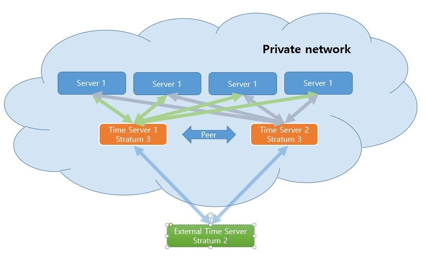

# NTP

> **목차**
> 1. 개요
> 2. NTP를 이용한 시간 동기화
> 3. Time server 구성
> 4. 윤초 대응


#1. 개요

이 문서에서는 ***ntp*** daemon을 이용하여 서버의 시간을 동기화 하는 방법과, ***ntp*** daemon을 이용하여 Time service를 하는 방법에 대해서만 기술하며, ***ntpq***를 이용하여 ***ntpd***를 관리하는 것에 대해서는 다루지 않습니다. ***ntpq***를 이용한 ***ntpd*** daemon 관리에 대해서는 Redhat Enterprise Linux 7 [System Administrator Guide 16. CONFIGURING NTP USING NTPD](https://access.redhat.com/documentation/en-US/Red_Hat_Enterprise_Linux/7/html/System_Administrators_Guide/ch-Configuring_NTP_Using_ntpd.html)를 참고 하십시오.

Time server 설정 전에 우선 알아야 할 것이 ***Stratum*** 이라는 의미입니다. ***Stratum***은 지층이라는 의미로, NTP protocol은 피라미드 형식의 구성으로 이루어져 있기 때문에, ***Stratum*** 0은 피라미드의 꼭대기라고 비유할 수 있습니다.

***Stratum*** 0은 ***primary reference clock*** 이라고 부르며, NTP protocol과는 상관이 없습니다. 즉 직접적으로 시간 서비스를 하는 것은 아니며, ***Stratum*** 1로 시간을 전송하는 장비들을 말하며 ***primary reference clock*** 장비에는 *GPS*, *세슘 원자 시계* 등이 있습니다.

보통 ***Stratum*** 1 level의 서버들은 ***primary reference clock***에서 시간을 동기화 하여 서비스를 하며, NTP에서 최상위층이라고 생각하면 됩니다.

다만, ***Stratum*** 1 level의 서버들은 client들이 ***Stratum*** 1 서버에서 동기화를 하면 시간이 더욱 정확할 것이라는 생각으로 ***Stratum*** 1 서버들을 설정하여 서비스 부하가 높아져서 ***Stratum*** 2 서버들에만 접근을 허가하고 access를 막아 놓은 경우가 대부분 입니다.

또한, NTP 구성 목적이 대부분 정확한 시간 보다는 시간의 동기화에 있기 때문에 꼭 최상위 ***stratum***에 동기화를 할 이유가 별로 없기 때문에 ***Stratum*** 2 정도에 sync를 하는 것을 권장 합니다.

NTP protocol과 서비스에 대한 자세한 설명은 http://time.ewha.or.kr/ 을 참조 하십시오.

##2. NTP를 이용한 시간 동기화


***ntp***는 Time service를 하지 않고 서버의 시간 동기화를 하기만 하려고 해도 기본적으로 daemon으로 구동을 해야 합니다.

안녕 리눅스 3은 설치시에 기본적으로 *Stratum 2* 또는 *Stratum 3*으로 구성된 *CentOS NTP pool*에 등록되어 있는 외부 Time server로 부터 시간을 동기화 하도록 되어 있습니다. 즉, 단순히 서버의 시간 동기화를 위해서라면, 별도의 설정을 건드릴 필요 없이 ***ntpd***만 실행을 시켜 주면 된다는 의미입니다.

안녕 리눅스 3은 시간 동기화를 위하여 기본으로 ***chrony***를 제공합니다. 그러므로 ***NTP***를 사용하기 위해서는 ***chrony***를 제거한 후, ***NTP***를 설치해 주어야 합니다.

```bash
[root@an3 ~]$ yum remove chrony     # chrony package가 설치 되어 있다면 삭제하고 설치해야 함
[root@an3 ~]$ service ntpd enable   # booting 시에 구동 또는 'ntsysv-systemd' 명령을 실행해서 ntpd 체크
[root@an3 ~]$ service ntpd restart  # ntpd 시작
```

또한, 기본으로 설정이 되어 있는 *CentOS NTP pool*의 time server가 아니라 다른 Time server에서 동기화를 하고 싶다면 ***/etc/ntp/ntp.conf*** 에서 ***server*** 지시자에 원하는 Time server를 등록하면 됩니다.

```nginx
# Use public servers from the pool.ntp.org project.
# Please consider joining the pool (http://www.pool.ntp.org/join.html).
server 0.centos.pool.ntp.org iburst
server 1.centos.pool.ntp.org iburst
server 2.centos.pool.ntp.org iburst
server 3.centos.pool.ntp.org iburst
```

만약 daemon으로 구동을 하기 싫다면, ***ntpd*** process를 중지시키고, ***ntpdate***를 이용하여 manual로 동기화 할 수 있습니다.

```bash
[root@an3 ~]$ service ntpd stop
[root@an3 ~]$ service ntpd disable
[root@an3 ~]$ yum install ntpdate
[root@ane ~]$ service ntpdate enable
```

위와 같이 명령을 실행을 하면, ***ntpd***는 구동하지 않으며, booting 시에 ***ntpdate***로 시간 동기화를 하게 됩니다. 주의할 점은 부팅시에 ntpdate는 /etc/chrony/chrony.conf 또는 /etc/ntp/ntp.conf의 ***server***로 등록되어진 time server로 부터 동기화를 하기 때문에 chonry.conf 또는 ntp.conf에 time server가 설정 되어 있어야 합니다. (chrony.conf가 ntp.conf 둘다 있다면 ntp.conf보다 chrony.conf가 우선 합니다.)


또한, 원할 때 ```ntpdate``` 명령을 실행함으로서 동기화를 할 수 있습니다.

```bash
[root@an3 ~]$ ntpdate 0.centos.pool.ntp.org
```

참고로, ntpd 구동 중 ***ntpdate*** 는 실행되지 않습니다. ntpd process가 떠 있지 않은 상태에서만 ***nptdate*** 를 사용할 수 있습니다.


##3. Time server 구성

많은 수의 서버를 관리할 경우, 모든 서버를 외부의 Time server를 이용하거나 또는 *CentOS NTP Pool*의 Time server를 이용할 경우, 서버마다 시간 차가 발생할 수 있습니다.

이럴 경우에는 local network에 Time server를 구성을 하고, 서버들이 이 Time server를 바라보게 하여 운영을 하는 것이 훨씬 더 좋습니다.

구성도를 보자면 다음과 같은 구성을 하는 것이 일반적 입니다.




내부에 fail over를 위해 Stratum 3 level의 Time server 2대를 구성하고, private network 안에 있는 server/client 들이 이 time server를 통해서 시간 동기화를 하도록 구성을 하도록 합니다.

그리고, 2대의 Time server 간에는 peer 구성을 하여 서로 동기화를 하게 할 수 있지만, 제 개인적인 견해로는 Time service 특성상 peer 구성 보다는 그냥 master 2대로 구성하는 것이 관리상 더 편했던 것 같습니다. 그래서 여기서는 peer 구성은 하지 않고 그냥 time server 2대를 독립적으로 구성하되, sync할 stratum 2 level의 서버를 동일하게 지정하여 peer 설정을 한 것과 비슷하게 구성을 할 것입니다.

여기서는 다음의 환경으로 Time Server 1과 Time Server 2를 구성하는 예로 설명을 합니다.

* local network : 10.0.0.0/8
* Time Server 1 IP: 10.10.0.1
* Time Server 2 IP: 10.10.10.1
* Time Server 1과 2는 Stratum 3로 구성

Time server를 운영하는 데 있어 사용되는 resource는 극히 적습니다. 실제로 Stratum 2 서버들 중에는 현재 486 machine으로 동작하는 경우도 있습니다. 그러므로, DNS나 DHCP 서버에 Time server 설정을 하는 것을 권장 합니다.

안녕 리눅스 3은 시간 동기화를 위하여 기본으로 ***chrony***를 제공합니다. 그러므로 ***NTP***를 사용하기 위해서는 ***chrony***를 제거한 후, ***NTP***를 설치해 주어야 합니다.

```bash
[root@an3 ~]$ yum remove chrony     # chrony package가 설치 되어 있다면 삭제하고 설치해야 함
[root@an3 ~]$ service ntpd enable   # booting 시에 구동
[root@an3 ~]$ service ntpd restart  # ntpd 시작
```

###3.1 /etc/ntp/ntp.conf

상단의 구성 처럼 2대의 Time server를 구성할 경우, 두대의 Time server간의 동기화를 위해서 peer 설정을 하게 됩니다. 하지만, Time server의 source stratum이 동일할 경우 굳이 peer 설정이 의미가 별로 없기 때문에 그냥 독립적인 time server 2대를 구성하는 것도 문제가 없습니다.

일단 안녕 리눅스 3의 ntp.conf에 등록이 되어 있는 Time server들은 대부분 Stratum 2 level 입니다. 그러므로 굳이 이를 변경할 필요는 없습니다. 굳이 원하는 time server가 있다면 찾아서 변경해 주시면 됩니다.

http://time.ewha.or.kr/domestic.html 를 참고 하여 Stratum 2 3개 정도, Stratum 3 1개 정도를 선택 합니다.

***ntp.conf***에서 Time server 설정을 하는데 있어 필요한 기본 설정에서 수정 또는 추가할 지시자는 ***server***, ***restrict***, ***fudge*** 입니다.

일단, 목표가 stratum 3 구성이므로, 기본 설정에 있는 server 설정은 변경할 필요는 없습니다. 혹시 변경 하고 싶다면 변경하셔도 무방합니다.

다음 기본 설정의 restrict 설정은 모두 다음과 같이 변경을 해 주어야 합니다.

```nginx
# localhost 에서의 모든 권한을 허가 한다.
restrict 127.0.0.1
restrict -6 ::1

# 기본적으로 모든 권한을 불허 한다.
restrict default ignore

# 10.0.0.0/255.0.0.0 에서 nomodify notrap 권한을 허가한다.
restrict 10.0.0.0 mask 255.0.0.0 nomodify notrap
```

그리고, 이 서버가 stratum 3 level의 서비스를 한다는 announce 설정을 추가 합니다.

```nginx
# Undisciplined Local Clock. This is a fake driver intended for backup
# and when no outside source of synchronized time is available.
server  127.127.1.0 # local clock
fudge   127.127.1.0 stratum 3
```

전체적으로 보면 ***/etc/ntp/ntp.conf***는 다음과 같이 되게 됩니다.

```bash
[root@an3 ~]$ cat /etc/ntp/ntp.conf
# For more information about this file, see the man pages
# ntp.conf(5), ntp_acc(5), ntp_auth(5), ntp_clock(5), ntp_misc(5), ntp_mon(5).

driftfile /var/lib/ntp/drift

# Permit time synchronization with our time source, but do not
# permit the source to query or modify the service on this system.
# 기본적으로 모든 권한을 불허 한다.
restrict default ignore

# Permit all access over the loopback interface.  This could
# be tightened as well, but to do so would effect some of
# the administrative functions.
# localhost 에서의 모든 권한을 허가 한다.
restrict 127.0.0.1
restrict ::1

# Hosts on local network are less restricted.
# 10.0.0.0/255.0.0.0 에서 nomodify notrap 권한을 허가한다.
restrict 10.0.0.0 mask 255.0.0.0 nomodify notrap

# Use public servers from the pool.ntp.org project.
# Please consider joining the pool (http://www.pool.ntp.org/join.html).
server 0.centos.pool.ntp.org iburst
server 1.centos.pool.ntp.org iburst
server 2.centos.pool.ntp.org iburst
server 3.centos.pool.ntp.org iburst

# Undisciplined Local Clock. This is a fake driver intended for backup
# and when no outside source of synchronized time is available.
server  127.127.1.0 # local clock
fudge   127.127.1.0 stratum 3

includefile /etc/ntp/crypto/pw

# Key file containing the keys and key identifiers used when operating
# with symmetric key cryptography.
keys /etc/ntp/keys

# Disable the monitoring facility to prevent amplification attacks using ntpdc
# monlist command when default restrict does not include the noquery flag. See
# CVE-2013-5211 for more details.
# Note: Monitoring will not be disabled with the limited restriction flag.
disable monitor
[root@an3 ~]$
```


###3.2 방화벽 설정

방화벽이나 subnet 구간에 switch ACL이 있다면 time server 1(10.10.0.1)과 time server 2(10.10.10.1)의 UDP 123번 포트를 open 해 주어야 합니다.

다음은 time server 자체에서 방화벽(oops-firewall 또는 firewalld)이 운영중일 경우 입니다. private network이라서 방화벽을 구동하고 있지 않다면 무시 하십시오.

time server에 ***oops-firewall***이 실행 되고 있다면 ***/etc/oops-firewall/filter.conf***의 ***UDP_ALLOWPORT***에 *123*을 추가해 주십시오.

```bash
[root@an3 ~]$ cat /etc/oops-firewall/filter.conf
  ** 상략 **
###########################################################################
# UDP configuration
###########################################################################
#
# Port configuration to open for all connections
#
# RULE:
#       DESTINATION_PORT[:STATE]
#
UDP_ALLOWPORT = 123
  ** 하략 **
[root@an3 ~]$ oops-frewall -v  # oops-firewall 재구동
[root@an3 ~]$
```

time server에 ***firewalld***가 실행이 되고 있다면 다음과 같이 하십시오.

```bash
[root@an3 ~]$ firewall-cmd --permanent --zone=public --add-port=123/udp
```


###3.3 daemon 구동 및 서비스 확인

```bash
[root@an3 ~]$ service ntpd restart
[root@an3 ~]$ netstat -anp | grep ":123"
udp    0  0 0.0.0.0:123       0.0.0.0:*          16137/ntpd
[root@an3 ~]$ ntpq -p
     remote           refid      st t when poll reach   delay   offset  jitter
==============================================================================
 send.mx.cdnetwo 131.107.13.100   2 u   17   64    1   35.047   25.632  11.802
*dadns.cdnetwork 133.100.8.2      2 u   17   64    1    0.401    5.476   0.089
 mail.funix.net  211.233.40.78    3 u   17   64    1    1.341   -4.687   0.113
```


###3.4 client 설정

Time server가 ***chrony***로 구축이 되었더라도, client에서 ***NTP***를 사용해도 무방 합니다.

####3.4.1 /etc/ntp/ntp.conf

client 설정에서는 ***server*** 지시자만 새로 만든 time server 1과 time server 2를 지정해 주면 되며, 그 외에는 수정할 필요가 없습니다.

```nginx
#server 0.centos.pool.ntp.org iburst
#server 1.centos.pool.ntp.org iburst
#server 2.centos.pool.ntp.org iburst
#server 3.centos.pool.ntp.org iburst
server 10.10.0.1 iburst
server 10.10.10.1 iburst
```

####3.4.2 방화벽 설정

client에 ***oops-firewall***이 실행되고 있다면 ***OUT_UDP_HOSTPERPORT***에 time server의 123번 포트를 설정해 주십시오. private network이라서 ***oops-firewall***을 구동하고 있지 않다면 무시 하십시오.

```bash
[root@an3 ~]$ cat /etc/oops-firewall/filter.conf
  ** 상략 **
##########################################################################
# UDP configuration
##########################################################################
#
# Configuration of the Port
# Designate the ports of the services from teh internal point to the
# external point.
#
# RULE:
#       DESTINATION_PORT[:STATE]
#
OUT_UDP_ALLOWPORT = 53

# To open specific port on specific host
#
# RULE:
#       DESTINATION_IP[:DESTINATION_PORT[:STATE]]
#
OUT_UDP_HOSTPERPORT = 10.10.0.1:123 10.10.10.1:123

[root@an3 ~]$ oops-firewall -v  # oops-firewall 재구동
[root@an3 ~]$


####3.4.3 ntpd 재시작 및 확인

***ntpd***를 재시작 한 후, ***ntpq***를 이용하여 확인을 합니다.

```bash
[root@an3 ~]$ service ntpd restart
[root@an3 ~]$ ntpq -p
     remote           refid      st t when poll reach   delay   offset  jitter
==============================================================================
 10.5.22.145     .INIT.          16 u    -   64    0    0.000    0.000   0.000
*10.10.0.1       141.223.182.106  2 u    2   64    1    0.173   -1.231   0.001
 10.10.10.1      211.237.1.226    3 u    1   64    1    1.099   -0.758   0.001
```

## 4. 윤초 대응

> ***윤초(閏秒)***란 협정 세계시에서 기준으로 삼고 있는 세슘 원자시계와 실제 지구의 자전·공전 속도를 기준으로 한 태양시의 차이로 인해 발생한 오차를 보정하기 위하여 추가하는 1초이다. 12월 31일의 마지막에 추가하거나, 혹은 6월 30일의 마지막에 추가한다.(출처: 위치백과)

보통 ***윤초***가 추가되게 되면, RHEL/CentOS에서는 ***tzdata*** package를 업데이트 하여 시스템에 반영을 하게 됩니다. (/etc/localtime을 윤초가 반영된 파일로 갱신 시켜 glibc가 reload 하도록 합니다.)

그런데 문제는 시간 동기화 데몬(chrony, npt, ptp 등)을 운영하는 경우 특정 버그로 인하여 문제가 되는 경우가 발생할 수있습니다. [대표적인 사건으로 2016.6.30일의 윤초 추가시에 ~~time server, 리눅스 커널 버그와 JVM 버그의 3단 컴비네이션~~으로 인하여 CPU 100% 사용률을 가지게 되는 장애를 발생시키는 사건이 있었습니다. (linkedIn, Reddit 등..)](https://translate.google.com/translate?hl=ko&sl=ja&tl=ko&u=https%3A%2F%2Fsrad.jp%2F~marusa%2Fjournal%2F593599%2F)

그래서 이를 원천적으로 회피하기 위한 기술로 Google에서 [Leap Smear](https://googleblog.blogspot.kr/2011/09/time-technology-and-leaping-seconds.html) 기법을 발표하고, ***NTP***에서 이를 설정 하는 방법을 기술 합니다.

다음의 설정은 ntp server를 운영하고 있다면 ntp server에만 반영해 주시면 되며, 따로 ntp server를 운영하고 있지 않다면 모든 ntp client 설정에 추가를 해 주어야 합니다. 즉, 서버가 많다면 straum 3정도의 NTP 서버를 운영하시는 것을 권장 합니다.

이 구성을 사용하기 위해서는 RHEL/CentOS 6.6 이상에 포함이 되어 있는 커널과 NTP package가 필요 합니다. 이전 버전에는 버그가 있습니다.

1. NTP 버전 업
  * time server 서버가 CentOS 5 이하라면, 최소한 CentOS 6 이상으로 업그레이드 하십시오.
  * 별도로 time server를 운영하지 않는다면, [leap-smeared time](https://developers.google.com/time/smear)이 적용된 Google Public NTP를 이용 하십시오.
```bash
[root@an3 ~]$ yum update ntp
```

2. ntpd 중지
```bash
[root@an3 ~]$ service ntpd stop
```
3. kernel의 유지시간 및 주파수 offset을 초기화 한다.
```bash
[root@an3 ~]$ ntptime -s 0 -f 0
```
4. nptd를 slew mode로 설정
  * ntpd 명령행 옵션에 -x를 추가해 준다. (slew mode option)
```bash
[root@an3 ~]$ cat /etc/sysconfig/ntpd
# Drop root to id 'ntp:ntp' by default.
OPTIONS="-x -u ntp:ntp -p /var/run/ntpd.pid -g"
[root@an3 ~]$
```
5. ntpd 재시작
```bash
[root@an3 ~]$ service ntpd start
```
